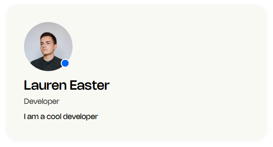

# React Practice Components

A growing collection of React components built for daily coding practice.
Built with **Next.js**, **TypeScript**, and **Sass**.

## Table of Contents

- [ProfileCard](#profilecard)
- [Avatar](#avatar)

## Components

### ProfileCard

Displays a user profile with avatar, name, role, and bio.

| Prop          | Type    | Required | Description             |
| ------------- | ------- | -------- | ----------------------- |
| name          | string  | ✓        | Full name               |
| role          | string  | ✓        | Job title               |
| bio           | string  | ✓        | Short bio               |
| initials      | string  | ✓        | Avatar fallback text    |
| isOnline      | boolean | ✓        | Online status indicator |
| profileImgUrl | string  | —        | Optional profile image  |

---

### Avatar

Circular avatar with online status indicator. Shows image or initials fallback.

| Prop          | Type    | Required | Description                |
| ------------- | ------- | -------- | -------------------------- |
| initials      | string  | ✓        | Fallback text e.g. "LE"    |
| isOnline      | boolean | ✓        | Controls status dot colour |
| profileImgUrl | string  | —        | Optional profile image URL |

---

## Tech Stack

- [Next.js](https://nextjs.org/)
- [TypeScript](https://www.typescriptlang.org/)
- [Sass](https://sass-lang.com/)
