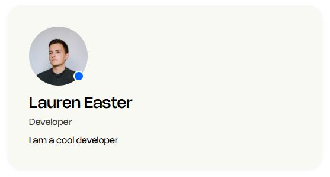

# React Practice Components

A growing collection of React components built for daily coding practice.
Built with **Next.js**, **TypeScript**, and **Sass**.

## Table of Contents

- [ProfileCard](#profilecard)
- [Avatar](#avatar)
- [ParallaxSections](#parallaxsections)
- [MirandaWebHero](#mirandawebhero)

## Components

### ProfileCard

Displays a user profile with avatar, name, role, and bio.

| Prop          | Type    | Required | Description             |
| ------------- | ------- | -------- | ----------------------- |
| name          | string  | ✓        | Full name               |
| role          | string  | ✓        | Job title               |
| bio           | string  | ✓        | Short bio               |
| initials      | string  | ✓        | Avatar fallback text    |
| isOnline      | boolean | ✓        | Online status indicator |
| profileImgUrl | string  | —        | Optional profile image  |

---

### Avatar

Circular avatar with online status indicator. Shows image or initials fallback.

| Prop          | Type    | Required | Description                |
| ------------- | ------- | -------- | -------------------------- |
| initials      | string  | ✓        | Fallback text e.g. "LE"    |
| isOnline      | boolean | ✓        | Controls status dot colour |
| profileImgUrl | string  | —        | Optional profile image URL |

---

### ParallaxSections

A scroll-driven parallax container with two animated sections. Tracks scroll progress across the full container height and applies inverse scale and rotation transforms to each section, creating a stacked card parallax effect.

Built with **Framer Motion**. Based on a [tutorial by Olivier Larose](https://www.youtube.com/watch?v=nZ2LDB7Q7Rk).

| Section  | Scroll behaviour                     |
| -------- | ------------------------------------ |
| Section1 | Scale 1 → 0.8, Rotation 0deg → -5deg |
| Section2 | Scale 0.8 → 1, Rotation -5deg → 0deg |

---

### MirandaWebHero

A full-screen parallax hero section with layered SVG elements that respond to mouse movement. Each layer moves at a different depth and speed to create a 3D parallax illusion, with spring smoothing applied for a natural, fluid feel.

Built with **Framer Motion** (`useMotionValue`, `useSpring`, `useTransform`).

| Layer     | Depth    | Behaviour                              |
| --------- | -------- | -------------------------------------- |
| folliage7 | Furthest | Minimal movement, subtle parallax      |
| fog6      | Far      | Slow drift with mouse                  |
| lake5     | Mid      | Looping vertical float, no mouse track |
| folliage3 | Mid-near | Mouse parallax + embedded doe figure   |
| folliage2 | Nearest  | Strongest parallax movement            |

## Tech Stack

- [Next.js](https://nextjs.org/)
- [TypeScript](https://www.typescriptlang.org/)
- [Sass](https://sass-lang.com/)
- [Framer Motion](https://www.framer.com/motion/)
